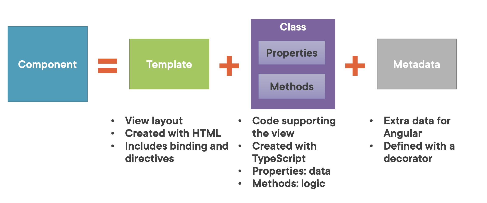
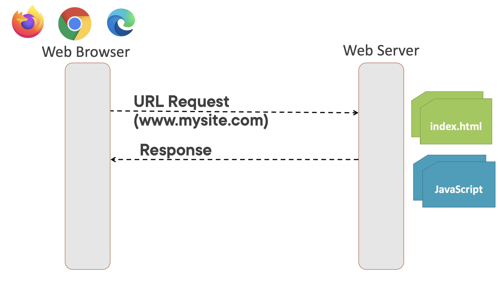
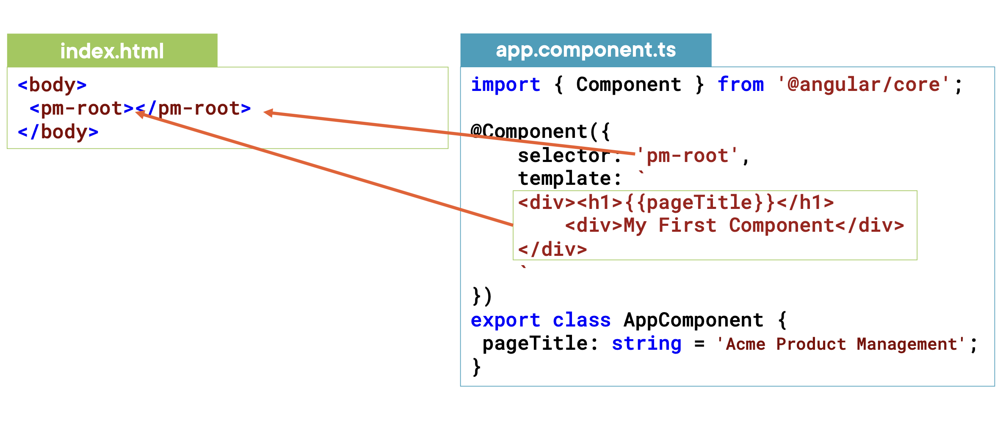
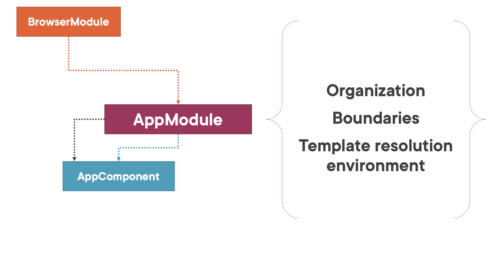

## What is Angular ?
- A javascript framework
- for building clinet-side applications
- Using HTML, CSS, Typescript

## WHY Angular ?
- Expressive HTML
- Powerfull data binding
- module by design
- build-in back0end integration

### Anatomy of an angular app:
```
Applications => component + component + component + ...     
                ---------------------------------------
                            services
```

### Component:
```                       
                          ----------------
component => Template +   |    Class     |  +  Metadata
                          |--------------|
                          |  Properties  |
                          |  methods     |
                          ----------------
              UI               CODE           Extra Data            
```

### TypeScript:
- Open-source 
- language Superset of JavaScript 
- Transpiles to plain 
- JavaScript Strongly typed
- Class-based object-orientation

- TypeScript Playground https://www.typescriptlang.org/play
- Pluralsight Course "TypeScript: Getting Started"

## 👉 Components:


app.component.ts
```
import { Component } from '@angular/core';                      # Import

@Component({                                                    # Metadata & Template
    selector: 'pm-root',
    template: `
    <div><h1>{{pageTitle}}</h1>
        <div>My First Component</div>
    </div>
    `
})

export class AppComponent {                                     # Class
    pageTitle: string = 'Acme Product Management';
    // methods can be used 
}

```
- class : class keyword
- AppComponent: component name when used in code | class name
- export: export keyword
- pageTitle: property name
- : string = Datatype
- 'Acme Product Management': Default value

### ☞ Defining the metadata:
- #### DECORATOR:
    - A function that adds metadata to a class, its members, or its method arguement.
    - Prefixed with an @
    - Angular provides built-in decorators.
    - @Component()
    ```
        @Component({                                                    # Metadata & Template
        selector: 'pm-root',
        template: `
            <div><h1>{{pageTitle}}</h1>
                <div>My First Component</div>
            </div>
            `
        })
    ```
    - @component : component decorator
    - 'pm-root': directive name used in HTML
    - ` <div><h1>{{pageTitle}}</h1>
                <div>My First Component</div>
            </div>` : View layout
    - {{pageTitle}}: data binding => data coming from property

### ☞ Importing what we Need:
- #### Import:
    ```
    import { Component } from '@angular/core';  
    ```
    - import: Import keyword
    - '@angular/core': angular library module name
    - Component: member name

### ☞ Bootstraping our app component:
1. Host your application
2. Defining angular module

### SINGLE PAGE APPLICATION (SPA):
    - Index.html contains the main page for the application
    - This is often the only web page of the application
    - Hence an angular application is often called SINGLE PAGE APPLICATION(SPA)
#### 1. Hosting application:


#### 2. Defining angular module:

app.module.ts
```
import { NgModule } from '@angular/core';
import { BrowserModule } from '@angular/platform-browser';
import { AppComponent }  from './app.component';
@NgModule({
  imports: [ BrowserModule ],           # import : external modules or any modules needed
  declarations: [ AppComponent ],       # Declarations: which of the component belong to this ngModule
  bootstrap: [ AppComponent ]           # bootstrap: starting component of the application
})
export class AppModule { }              # angular module
```