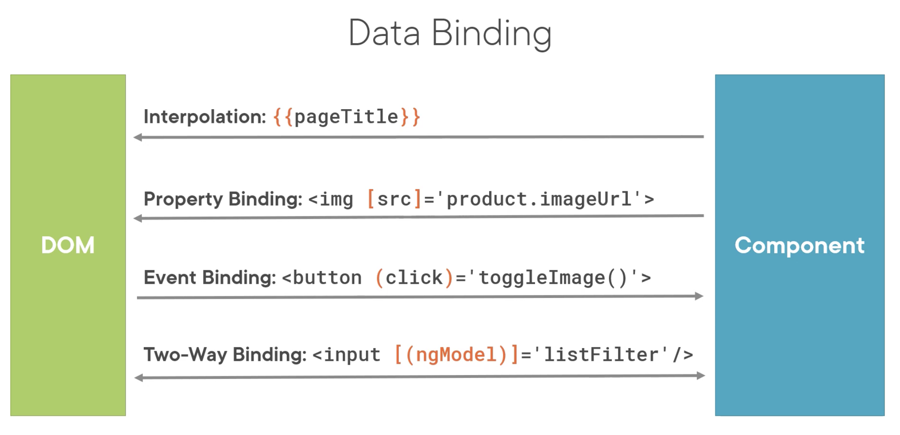

## 🔗 Data Binding & Pipes:
```
component         DOM
            -->  
properties  <--
```
- To provide a great interactive user experience, we want to bind DOM elements to component properties so the component can change the look and feel as needed.

## ☞ Property Binding:
```
           # using property binding
         # using intepolation
```
- Element property: [src]
- Template property: 'product.imagUrl'

## ☞ Event Binding:
- till now, using property bidning it is one way, component to template, now using event binding it will be other way `template to component`.
- bind even to the method.

Template:
```
<button (click)='toggleImage()'>
            |           |
            Event       Method
```

Component:
```
export class listComponent {
    pageTitle: string = 'Product list'
    toggleImage(): void {...}
}
```

## ☞ Handling inputs with 2 way binding:
Template:
```
<div class='col-md-2'>Filter by:</div>
<div class='col-md-4'>
    <input type='text' [(ngModel)]='listFilter'/>
</div>
```
- [()] = ngModel -> Directive: customer HTML Syntax

Component:
```
export class ListComponent {
    listFilter: string='cart'
}
```

## ☞ Transforming Data with Pipes:
- Transform bound properties before display
- Built-in pipes: date, number, decimal, percent. currency, json, etc
- Custom pipes

#### Pipe Examples:
```
{{ product.productCode | lowercase}}           # change the code to lowercase

           # change the title to upper case

{{ product.price | currency | lowercase }}
{{ product.price | currency : 'USD':'symbol':'1.2-2}} 
```

## 🔗 Summary:


- When using `ngModel`, we will have to import `FormsModule` in app.module.ts file
