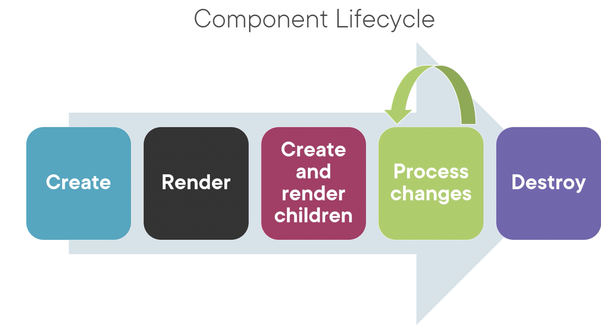

## 🔗 More on components:
- Strong typing & interfaces
- Encapsulating styles
- Lifestyle hooks
- Custom pipes
- Nested components

### ☞ Strong Typing:
```
products: any[] = [...]
```
- Above code, product array is defined as any, which negletes the benefits of strong typing. To specify the custom types, we can define an interface.

## ☞ Interface:
An Interface is a specification identifying a related set of properties and methods.

#### Two Way to Use an interface:
1. As a type:
    - Interface keyword
    - body contains the properties and its data type
    - we can then use/import it as a data type

    productInterface.ts
    ```
    export interface Iproduct {
            productId: number;
            productName: string;
            productCode: string;
            releaseDate: string;
            description: string;
            price: number;
            starRating: number;
            imageUrl: string;
    }
    ```

    Component.ts
    ```
    product: IProduct[] = [];
    ```

2. As a feature set :
    - here, we decalre rge properties and methods to implement a specific feature.
    - declaratins only, no code
    ```
    export interface DoTiming {
            count: number;
            start(index: number): void;
            stop(): void;
    }
    ```
    
    Component.ts
    ```
    export class myComponent implements DoTiming {
        count: number =0;
        start(index: number) : void {
            ...
        }
        stop(): void {
            ...
        }
    }
    ```
#### ☞ Handling Unique component styles:
- Templates sometimes require unieque styles
- We can inline the styles directly into the HTML
- We can build an external stlesheet and link it in index.html
- There is bettwe way as below

## ☞ Encapsulating component styles:
styles:
```
@Component({
    selector: 'pm-products',
    templateUrl: './product-list.component.html',
    styles: ['thread {colorL #337AB7;}']
})
```

styleUrls:
```
@Component({
    selector: 'pm-products',
    templateUrl: './product-list.component.html',
    styles: ['./product-list.component.css']
})
```
---
## ☞ Component LifeCycle Hooks:


#### A `LifeCycle hooks` is an interface we implement to write code when a component lifecycle event occurs.

### ☞ Component Lifecycle hooks:
1. `OnInit`: Perform component initilization

    ```
    2
    import {Component, OnInit } from '@angular/core';

    1
    export class ProductListComponent implements OnInit {
        pageTitle: string = 'product List';
        showImage: boolean = false;
        listFilter: string = 'cart';
        products: IProduct[] = [...];
    }

    3
    ngOnInit(): void {
        console.log('In OnInit');
    }
    ```
    - here we we use ng prefix to OnInit : ngOnInit, we dont need to implement any lifecycle hooks like, `implements OnInit`
2. `Onchanges`: Perform action after change to input properties
3. `OnDestroy`: Perform cleanUp
---
### ☞ Custom Pipes:
- Create a class that implements PipeTransform Method.
- Then, add the pipe to the declarations array of angular module.
```
import { Pipe, PipeTransform } from '@angular/core'

# decorator
@Pipe({
    name: 'convertToSpaces'
})

export class ConvertToSpacesPipe implements PipeTransform {
    transform(value: string, character: string): string  {
        return value.replace(character, ' ');
    }
}
```

Usimg PIpe is Template:
```
<td>{{ product.productCode | convertToScopes:'-'}}</td>
```

Pipe:
```
transform(value: string, character: string): string {   
    return value.replace(character, ' ');
}
```

- here, product.productCode will be taken as a value and '-' will be taken as character to transform method arguement
- we also need to declare this in angular module file to be able to use component
---
### ☞ Getters & Setters:

```
amount: number = 0;
```

```
get amount(): number {
    // process the ammount
    // retain amount from the private storage
    return this._amount;
}

set amount(value: number) {
    // process the ammount
    // retain amount from the private storage
    this._amount = value;
}

this.amount = 200;
console.log(this.amount);
```
---
## ☞ Filtering & Arrow Functions:
### Filtering a List:
- Filter methods creats a new array, then it compare the value with original array eithee to include or not in the new array and then return new array containing omly the filtered products.
```
products: IProduct[] = [...];
performFilter(): IProduct[] {
    return this.products.filter
}
```

Using arrow function to filter the List:
```
performFilter(): IProduct[] {
    return this.products.filter((product:IProduct) => {
        product.productName.includes(this.listFiler);
    })
}
```

### Arrow Functions:
- An arrow function is compact syntax for defining a function.

Classic named function (method):
```
capitalizeName(product: IProduct): string {
    return product.productName.toUpperCase();
}
```

Arrow function:
```
(product: IProduct) => product.productName.toUpperCase();
```

Multi-statement arrow function
```
(product: IProduct) => {
    console.log(product.productName);
    return product.productName.toUpperCase();
}
```