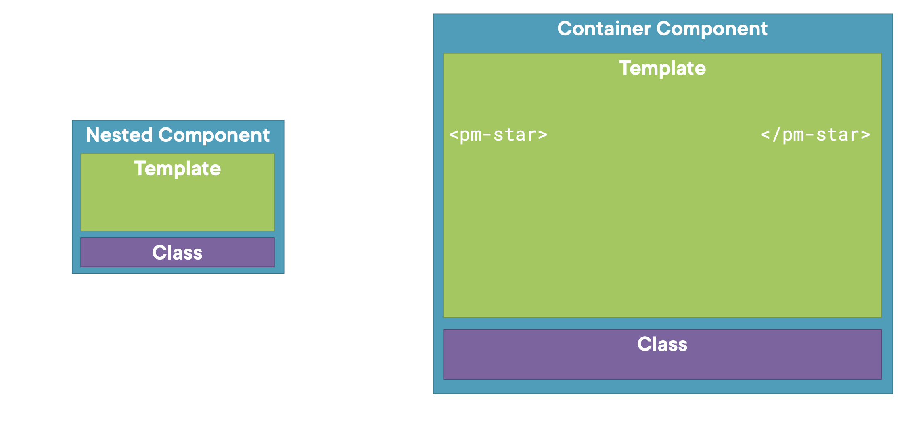
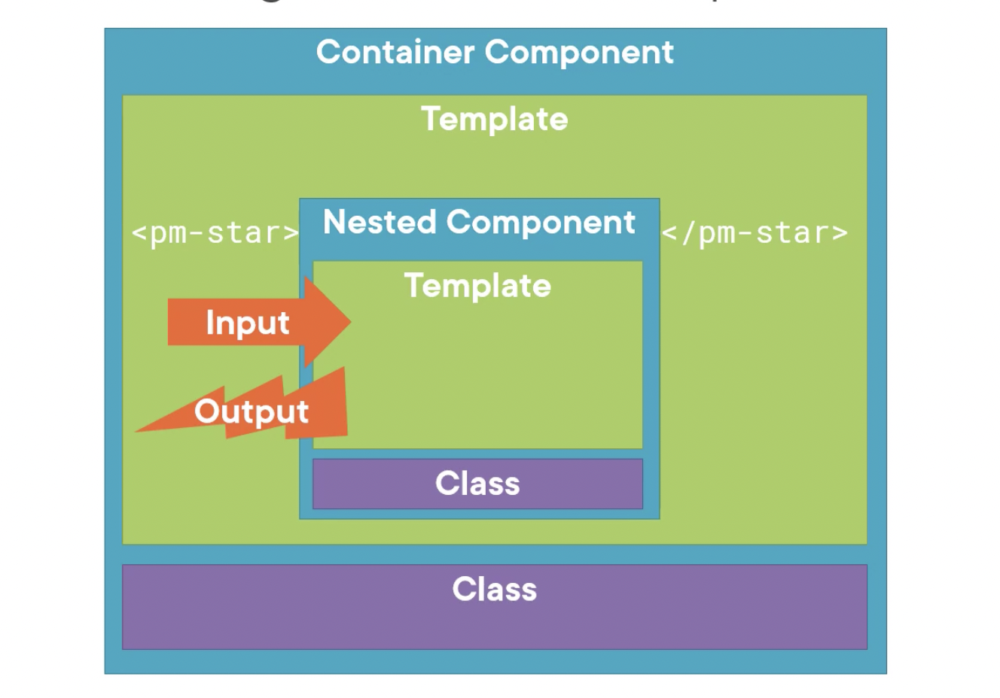

## Building nested components:

### ☞ using Component:
1. As a directive:
    - App component or nested component
    - we call it by using selectors in the templates
        ```
        <div>
            <pm-root></pm-root>
        </div>
        ```
2. As  a routing target:
    - full page style view

### What makes component Nest-able:
- its template manages the fragment of a larger view
- It has a selector
- it optionally communicates with its container.

---

### ☞ Building nested component

- we will use this component inside our container component as nested or child component.

---

### ☞ Passing data to nested component(@Input):

- Nested component receives info from its container using @input prope  rties
- nested component outputs the information back to container by emitting events. using output properties.

star.component.ts
```
...
@Input() rating: number;
...
```

product-list.component.html
```
<pm-start [rating]='product.startRating'></pm-star>
```
- here we use property binding.
- in this example,  product-list template uses property binding to pass the product's starRating to the startComponent.
- The container component can nly bind to the nested component properties, that is marked with @Input decorator

---

### ☞ Passing data from the nested component(@Output):
#### Event emmiter using @Output decorator
star.component.ts
```
...
@Input() rating: number;
@Output() ratingClicked: EventEmmiter<string> = new EventEmmitter<string>();
onClick() {
    this.ratingClicked.emit('clicked!');
}
...
```
- Added ratingClicked event here,

star.component.html
```
...
<div (click)='onClick()'>
...star...
</div>
...
```
- added click event that will emit the info to parent component

product-list.component.html
```
<pm-start [rating]='product.startRating'
           (ratingClicked)='onRatingClicked($event)'></pm-star>
```
- here, we do event binding to get the data from nested component

product-list.component.ts
```
export class ProductListComponent {
    onRatingClicked(message: string): void {
        this.pageTitle = 'Product List' + message;
      }
}
```
- here we use the data to display in the parent component emitted by the nested 

---

### Notes:
- `Directive`: custom HTML that power up the HTML 