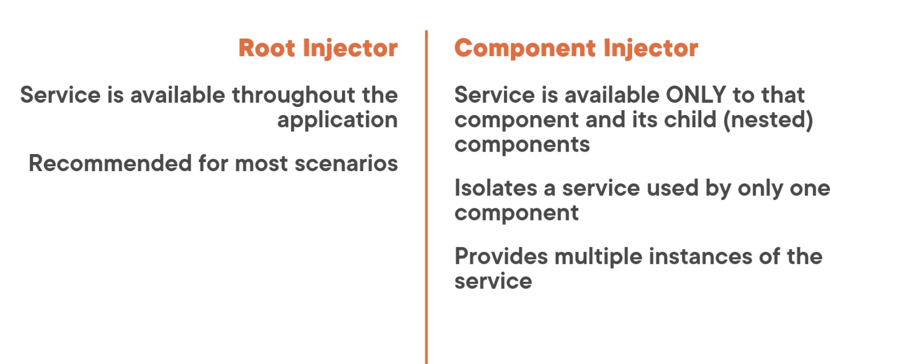

## Services & depencency injection:

### ☞ Sevices:
- A class with focused purpose
- Used for features that:
    - Are independent from any particular component
    - Provide shared data or logic across components
    - Encapsulate external interactions

### How does service works:

Service:
```
export class myService {}
```

Component:
- Two ways to use the service in component:
    1. Using instance of service class
        ```
        let svc = new myService();
        ```
        - But it is a instance ot local, so we cannot share the data or other resource
    
    2. `Register the service with angular`, angular then creates the instance of service class, called a `singleton`. Specially angular provides built-in injector.We register services with angular injector, which maintains a container of created service instances. It uses `dependency injection` concept.
        ```
        constructor(private myService) {}
        ```

Injector:
```
 __      __      ___
|  |    |  |    |   |
----    ----    -----
logic   math     svc
```
### ☞ Dependency Injections:
- Angular provides built-in injector.We register services with angular injector, which maintains a container of created service instances.
- The injector creates and manages the single instance or singleton of each registored service as required.
- in this example, angular injector is managing the  instances of 3 diff services [log, math, svc].
- Now, if the component needs service, the component class defines the service as a dependency.
- the angular injector then provides, or inject, the service class instance when the component class is instantiated. This process is called `Dependency Injection`.
- Since, angular manages the single instance, so any data or logic will be shared by all the classes that use it.   
- `DEFINITAION`:A coding pattern  in which a class receives the instances of objects it needs(called dependencies) from external source rather than creating them itself.

### ☞ Building the service:
1. Create the service class
2. Define the metadata with a decorator
3. Import what we need.

product.service.ts
```
import { Injectable } from '@angular/core'

@Injectable()
export class ProductService {
    getProducts(): IProduct[] {

    }
}
```
- This service will have 1 method that will return list of products.
- Next, we need to add decorator for this service metadata.
- Lastly, we import what we need.

### Registering a services (WHEN TO USE WHAT?):
1. Using root injector
    ```
    import { Injectable } from '@angular/core'

    @Injectable({
        providedIn: 'root'                          # decides root injector and can we accessable from any component or other service
    })
    export class ProductService {
        getProducts(): IProduct[] {

        }
    }
    ```
2. Component Injector:
    ```
    @Component({
        templateUrl: './product-list.component.html'
        providers: [ProductService]
    })

    export class ProductListComponent {}
    ```


### ☞ Injecting the service :
```
    @Component({
        templateUrl: './product-list.component.html'
        providers: [ProductService]
    })
    export class ProductListComponent {
        constructor(private productService: ProductService) {
            this._productService  = productService;
        }
    }
```
- Using contructor. Every class as a constructor that is executed when the instance of the class is created.
- if there is not explicit constructor is defined for the class, we can use implicit constructor is used.
- But, if we want to inject dependencies such as an instance of a service,we need explicit constructor.
- contsructor is basically used for initialisation, but not for he code that takes time for execution.
- add access medifier as private.